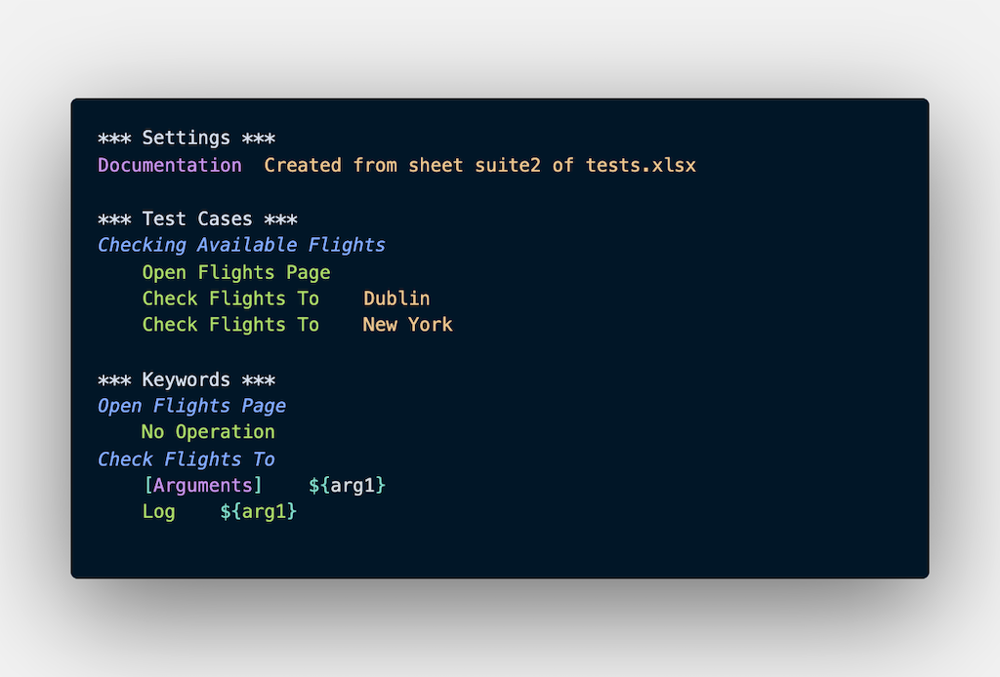

Script to convert tests defined in the Excel file into Robot Framework .robot files.

Each Excel worksheet generates a Robot file.

## How to install

```bash
pip install robot-test-creator
```

## How to use

```bash
rtc -i tests.xlsx
```

## Examples

Excel Example (tests.xlsx)


generated suite1.robot


generated suite2.robot


